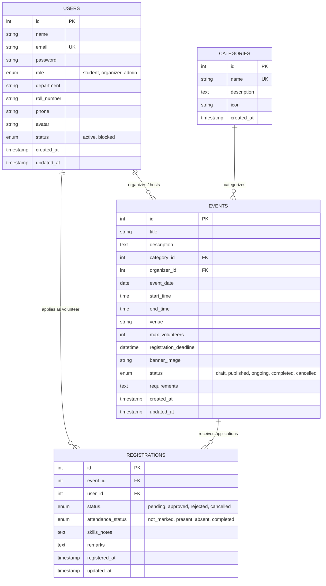

# 🎓 College Event Volunteer Management System (VoluntSync)

A production-grade, full-stack web application designed for collegiate event volunteer coordination, developed as a **2nd-year B.Tech Project for College Tech Expo 2026**.

---

## 📌 Project Overview

**VoluntSync** streamlines the coordination between student volunteers, event organizers (faculty/clubs), and college administrators. The platform eliminates manual paper forms and unorganized spreadsheets by providing real-time volunteer recruitment, strict capacity tracking, deadline enforcement, attendance logging, and administrative oversight.

---

## 🚀 Tech Stack

- **Frontend**: React.js 18 with Vite, Tailwind CSS, Lucide React, React Router v6, Axios
- **Backend**: Node.js, Express.js (Modular MVC architecture), JWT Authentication, bcryptjs
- **Database**: MySQL 8.x (Relational design with foreign keys and cascade rules via `mysql2/promise`)
- **Security**: Password hashing with bcrypt, JWT Bearer tokens, HTTP-only best practices, role-based authorization guards, input validation with `express-validator`

---

## 👥 User Roles & Features

### 1. 🎓 Student / Volunteer
- **Account Registration & Login**: Custom profile with Academic Department, Roll/Student ID, and Contact details.
- **Event Discovery**: Filter by Categories (Technical, Cultural, Sports, Workshops, Social), upcoming dates, keyword search, and live capacity indicators.
- **1-Click Volunteer Application**: Apply with optional skill notes (e.g. past experience, audio setup, networking, first aid).
- **Application Safeguards**:
  - Duplicate application prevention.
  - Automatic deadline enforcement.
  - Real-time volunteer capacity check.
- **My Registrations Dashboard**: Track application status (`Pending`, `Approved`, `Rejected`, `Cancelled`), view coordinator remarks, and attendance status.
- **Application Withdrawal**: Ability to cancel a registration anytime before event execution.
- **Profile & Security**: Edit contact details and change password.

### 2. 📅 Event Organizer (Faculty / Student Clubs)
- **Organizer Dashboard**: Real-time metrics (Total Events Created, Active Mobilized Volunteers, Pending Review Queue, Active Events).
- **Event Management**: Create, edit, publish, and delete events with date, time, venue, category, banner image, and maximum volunteer quotas.
- **Volunteer Review & Approval**:
  - Review student profiles, department, roll number, and skills.
  - Approve or Reject applications with custom feedback remarks.
  - Hard limit enforcement prevents exceeding the maximum volunteer capacity.
- **Attendance & Participation Tracking**: Mark volunteer participation as `Present`, `Completed Shift`, or `Absent` with performance notes.

### 3. 🛡️ System Administrator
- **Admin Command Center**: System-wide KPIs (total students, organizers, events, applications, approval rates, shift completion percentages).
- **Department-Wise Analytics**: Track volunteer engagement across academic departments.
- **User Directory**: Search and manage all accounts, toggle Active/Blocked status, update roles, create faculty organizers, or delete users.
- **Global Event Moderation**: Full audit and moderation over all campus events across all clubs and faculties.
- **Global Application Audit**: View and override registration statuses university-wide.

---

## 🗄️ Database Architecture & Relational Schema

### Database: `college_volunteer_db`



---

## 🔑 Authentication & Account Access

VoluntSync supports role-based authentication with encrypted password hashing:

- **🛡️ Admin**: Manage users, oversee campus events, review analytics, and create organizer accounts from the Admin Dashboard.
- **📅 Organizer**: Hosted event management, volunteer recruitment, and attendance verification.
- **🎓 Student / Volunteer**: Public registration available on the Register page (`/register`), followed by sign-in via standard email/password on `/login`.

---

## 🛠️ Step-by-Step Installation & Setup

### Prerequisites
- **Node.js** (v18+ recommended)
- **MySQL Server** (v8.0+ or XAMPP / WampServer MySQL)
- **npm** (v9+)

---

### Step 1: Clone or Open the Project
Ensure you are in the project root directory:
```bash
cd College-Event-Volunnteer-System
```

---

### Step 2: Configure Environment Variables

1. Open `backend/.env` (or copy from `backend/.env.example`):
```env
PORT=5000
NODE_ENV=development

# MySQL Database Connection Settings
DB_HOST=localhost
DB_USER=root
DB_PASSWORD=your_mysql_password
DB_NAME=college_volunteer_db
DB_PORT=3306

# JWT Authentication
JWT_SECRET=super_secret_jwt_key_college_events_2026_change_in_production
JWT_EXPIRES_IN=7d

# Frontend CORS
CLIENT_URL=http://localhost:5173
```

---

### Step 3: Initialize & Seed the MySQL Database

Make sure your MySQL server is running (e.g. through MySQL Workbench, XAMPP, or Windows MySQL Service).

Run the automated database setup script from the `backend/` directory:

```bash
cd backend

# 1. Create database and tables from database/schema.sql
npm run db:init

# 2. Insert sample categories, users, events, and registrations from database/seed.sql
npm run db:seed
```

*(Alternatively, you can manually import `database/schema.sql` and `database/seed.sql` into MySQL Workbench or phpMyAdmin).*

---

### Step 4: Start the Backend Server

From the `backend/` folder:
```bash
npm start
```
The REST API server will start on **`http://localhost:5000`** with live database connection validation.

---

### Step 5: Start the Frontend Application

Open a new terminal tab/window and navigate to `frontend/`:
```bash
cd frontend

# Start the Vite development server
npm run dev
```

The frontend will run at **`http://localhost:5173`**.

---

## 📁 Project Directory Structure

```text
College-Event-Volunnteer-System/
├── .env.example
├── .gitignore
├── README.md
│
├── database/
│   ├── schema.sql              # MySQL DDL table schemas with relational constraints
│   └── seed.sql                # Seed data with realistic events and bcrypt hashed users
│
├── backend/
│   ├── package.json
│   ├── .env                    # Configured backend environment variables
│   ├── .env.example
│   ├── server.js               # Express app entry, CORS, and route mounting
│   ├── config/
│   │   └── db.js               # MySQL2 connection pool (Promises API)
│   ├── controllers/
│   │   ├── authController.js   # Register, Login, Me, Profile, Password Change
│   │   ├── eventController.js  # CRUD events, public directory, filters
│   │   ├── registrationController.js # Volunteer application, capacity validation, status
│   │   ├── adminController.js  # Statistics, user moderation, global audits
│   │   └── categoryController.js # Event categories listing & creation
│   ├── middleware/
│   │   ├── authMiddleware.js   # JWT verification & active status check
│   │   ├── roleMiddleware.js   # Role-based authorization (admin/organizer/student)
│   │   ├── validateMiddleware.js # express-validator error catcher
│   │   └── errorMiddleware.js  # 404 and global 500 error handlers
│   ├── routes/
│   │   ├── authRoutes.js
│   │   ├── eventRoutes.js
│   │   ├── registrationRoutes.js
│   │   ├── adminRoutes.js
│   │   └── categoryRoutes.js
│   └── scripts/
│       ├── initDb.js           # Automated schema executor
│       └── seedDb.js           # Automated seed data executor
│
└── frontend/
    ├── package.json
    ├── vite.config.js          # Vite config with API proxy
    ├── tailwind.config.js      # Custom theme colors and shadows
    ├── postcss.config.js
    ├── index.html
    └── src/
        ├── index.css           # Tailwind directives & typography
        ├── App.jsx             # React Router configuration with protected & role routes
        ├── main.jsx            # React root mount
        ├── api/
        │   ├── axiosClient.js  # Axios instance with JWT interceptors
        │   └── services/       # Modular API service classes
        ├── context/
        │   ├── AuthContext.jsx # Global user auth state & credentials helper
        │   └── ToastContext.jsx# Toast notification system
        ├── components/
        │   ├── common/         # Navbar, Sidebar, Footer, Badge, StatCard, Modal, etc.
        │   └── layout/         # MainLayout and DashboardLayout
        └── pages/
            ├── public/         # HomePage, EventsList, EventDetails, Login, Register, 404
            ├── student/        # StudentDashboard, MyRegistrations, Profile
            ├── organizer/      # OrganizerDashboard, ManageEvents, CreateEditEvent, EventVolunteers
            └── admin/          # AdminDashboard, UserManagement, EventManagement, Registrations, Stats
```

---

## 🧪 Verification & API Endpoints

### 🔐 Auth Endpoints
- `POST /api/auth/register` - Student registration
- `POST /api/auth/login` - User login (all roles)
- `GET /api/auth/me` - Authenticated user details
- `PUT /api/auth/profile` - Update profile details
- `PUT /api/auth/change-password` - Change password

### 🎪 Event Endpoints
- `GET /api/events` - Public event catalog with search, category, and date filtering
- `GET /api/events/:id` - Detailed event info and user's registration status
- `POST /api/events` - Create event (Organizer / Admin)
- `PUT /api/events/:id` - Update event (Organizer / Admin)
- `DELETE /api/events/:id` - Delete event (Organizer / Admin)
- `GET /api/events/organizer/my-events` - Organizer's hosted events

### 📝 Registration Endpoints
- `POST /api/registrations/:eventId` - Register student volunteer (Validates deadline, duplicate & capacity)
- `GET /api/registrations/my` - Student's registered events and statuses
- `DELETE /api/registrations/:id/cancel` - Cancel a registration
- `GET /api/registrations/event/:eventId` - View applicants for an event (Organizer / Admin)
- `PATCH /api/registrations/:id/status` - Approve / Reject applicant (Organizer / Admin)
- `PATCH /api/registrations/:id/attendance` - Log volunteer attendance (Organizer / Admin)

### 🛡️ Admin Endpoints
- `GET /api/admin/stats` - High-level system statistics and analytics
- `GET /api/admin/users` - Paginated user management table
- `POST /api/admin/users` - Create organizer or admin accounts
- `PATCH /api/admin/users/:id/status` - Block / Unblock user
- `PATCH /api/admin/users/:id/role` - Change user role
- `DELETE /api/admin/users/:id` - Delete user
- `GET /api/admin/registrations` - Global registrations audit log

---

## 🔮 Upcoming Features (Phase 2)

As planned, the following advanced features will be added in Phase 2:
- 📱 Dynamic QR Code check-in generation for volunteer presence verification.
- 🎫 Digital volunteer event pass generator (PDF / Wallet export).
- 📜 Automated PDF Certificate of Appreciation generation upon shift completion.
